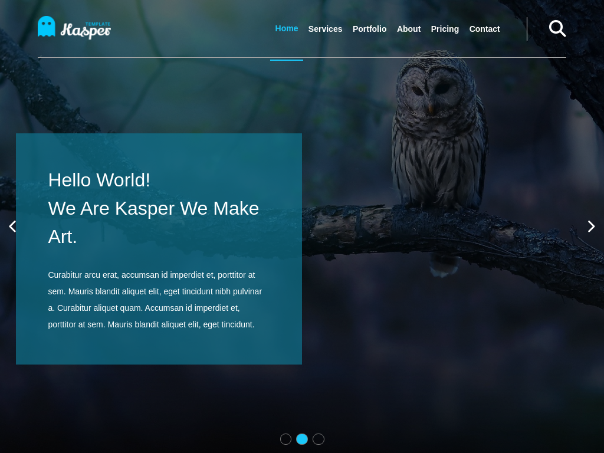

# Kasper-Template

This is [Kasper Template] Project using HTML and CSS and Javascript.
built this after watching Elzero Tutorial and added the Javascript part, the whole project was for practice and it is part of my 50 projects challenga.

## Table of contents

- [Overview](#overview)
  - [The Objective](#the-objective)
  - [Screenshot](#screenshot)
  - [Links](#links)
- [My process](#my-process)
  - [Built with](#built-with)
- [Author](#author)
- [Acknowledgments](#acknowledgments)

## Overview

### The objective

Users should be able to:

- View the optimal layout depending on their device's screen size (Responsive Design)
- See hover states for interactive elements
- open and toogle menu on mobile screen
- use Filter to shuffle images in portfolio
- see dynamic on-scroll counting up in stats and skill

### Screenshot

### Links

- Live Site URL: [here](https://ibrahimalsabr.github.io/Kasper-Template/)

## My process

### Built with

- Media Queries And Responsive Design
- Flexbox
- CSS Grid
- Mobile-first workflow
- vannila Javascript

## Author

## Acknowledgments

- [Elzero Academy](https://elzero.org/)
